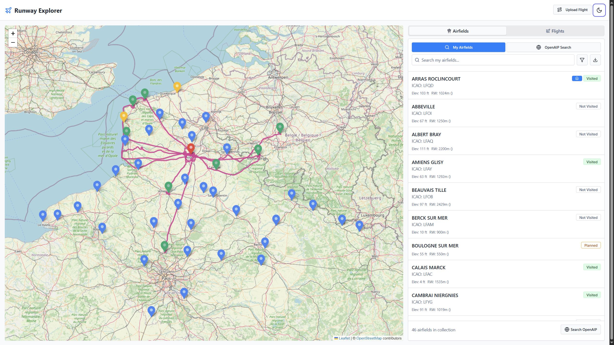
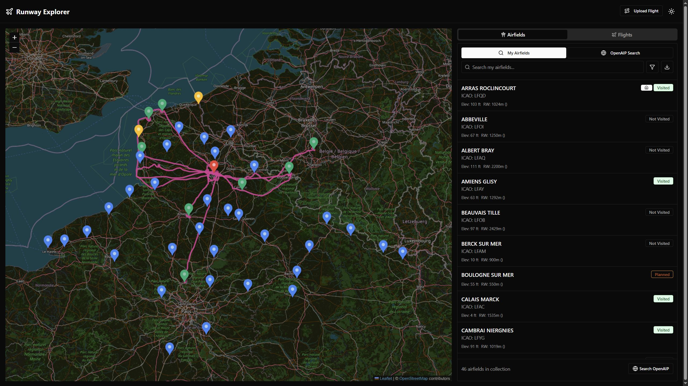

# Runway Explorer

Runway explorer is a small application for private pilots designed to visualize airfields you visited or want to visite in futur flights 🛩️

## Features
- **Interactive Map**: View airfields and flight paths with dynamic markers.
- **Flight Path Management**: Load your previous flight trace (GPX or KML files), auto add airfields, and keep track of where you landed.
- **Airfield Management**: Manage your airfields bucket list, access detailed information with OpenAIP integration.

|VFR|Night VFR|
|---|---|
|||

## Tech Stack
- React 18.2.0 + TypeScript 5.7.2 + Vite 6.3.1
- Tailwind CSS 3.4.1 + shadcn/ui
- React Router 7.5.1

## Roadmap
A roadmap is available in [ROADMAP.md](ROADMAP.md).

## Quick Start

1. Install dependencies (recommended: bun):
```bash
# Using bun (recommended - faster)
bun install

# Or using npm
npm install
```

2. Start development server:
```bash
bun dev
# or
npm run dev
```

3. Build for production:
```bash
bun run build
# or
npm run build
```

## Development
- Local server: http://localhost:5173
- Built with modern React patterns and TypeScript
- Responsive design with Tailwind CSS
- Pre-configured shadcn/ui components
